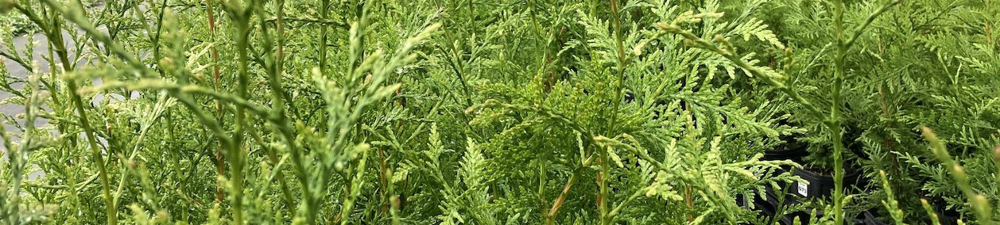
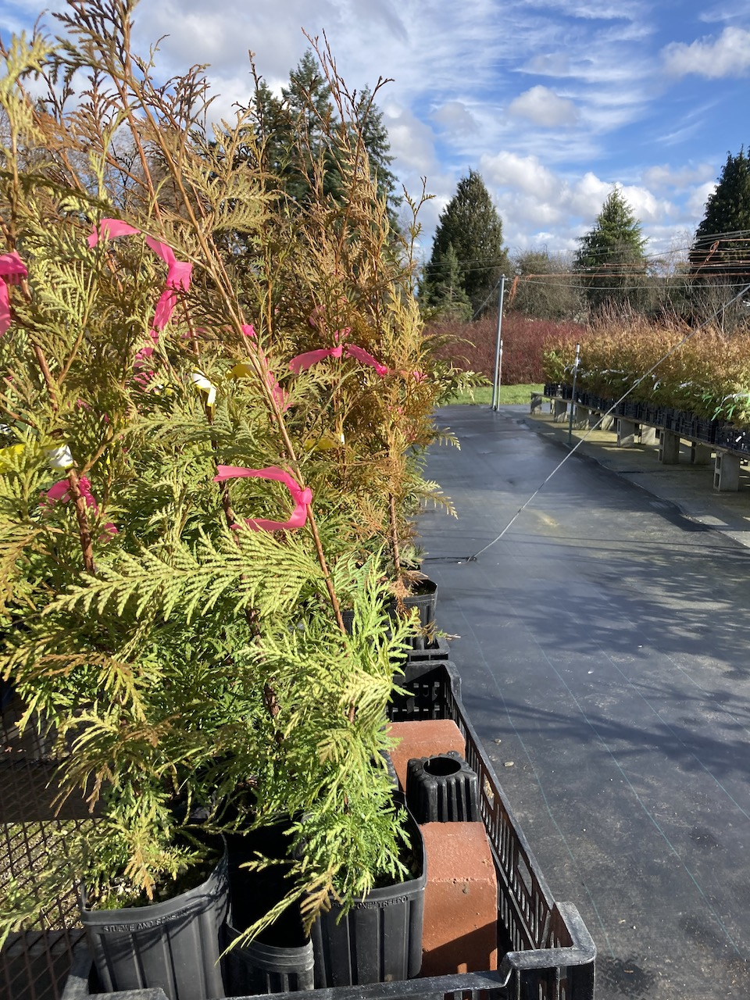
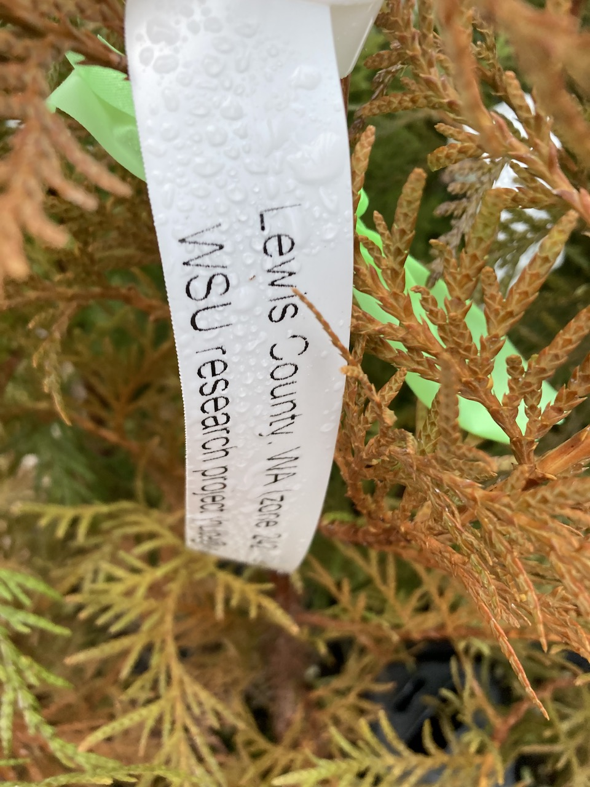
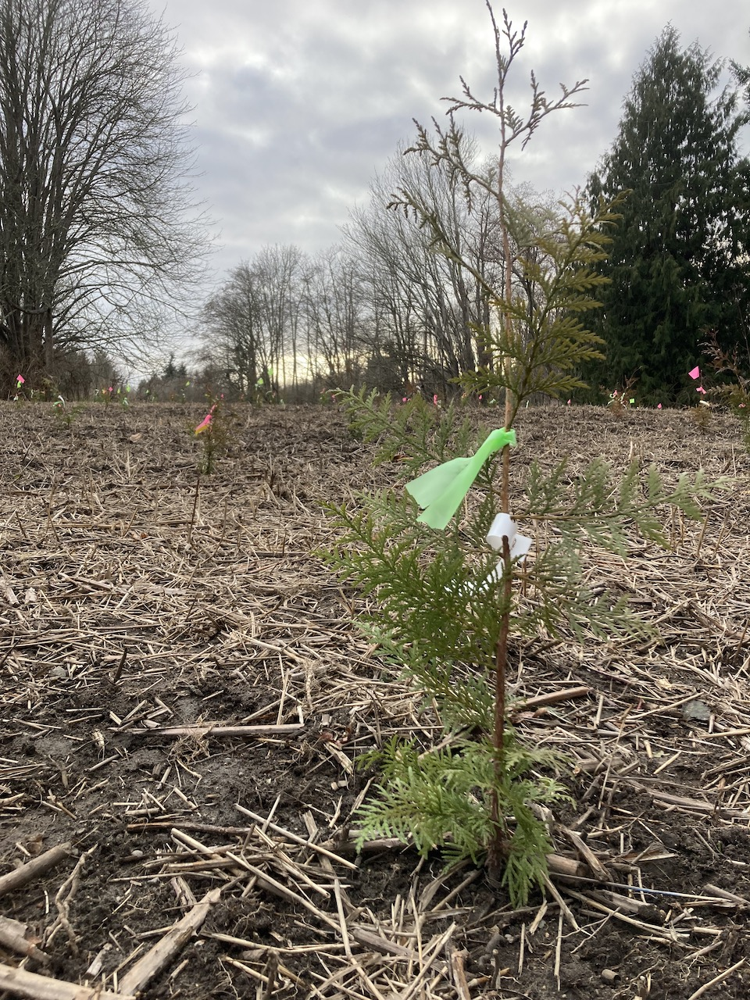
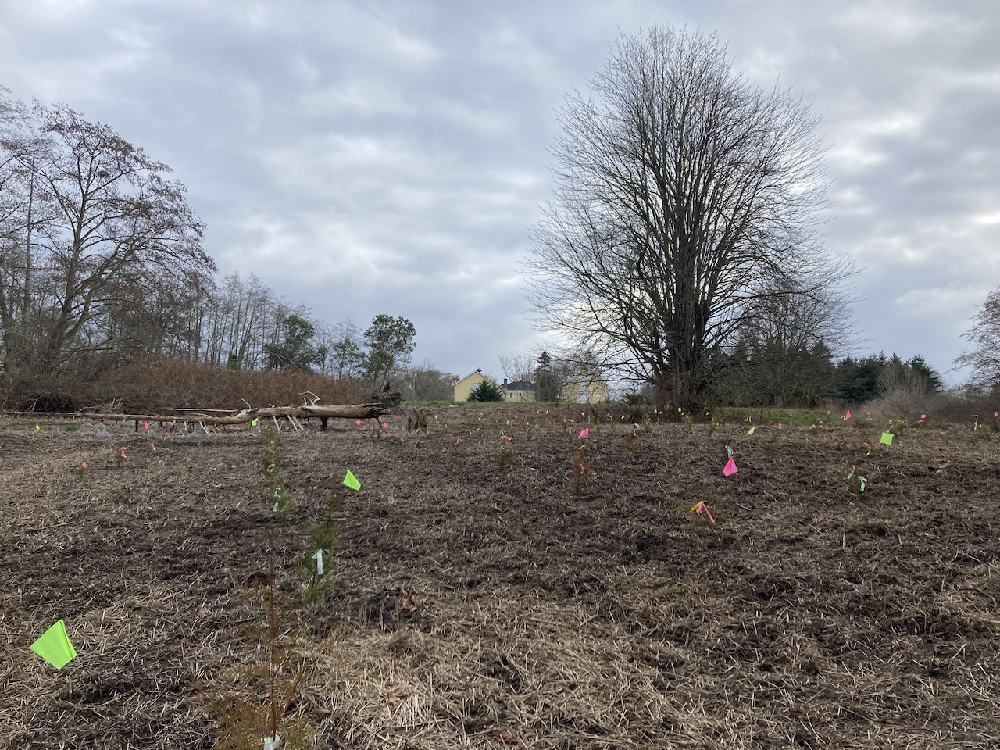
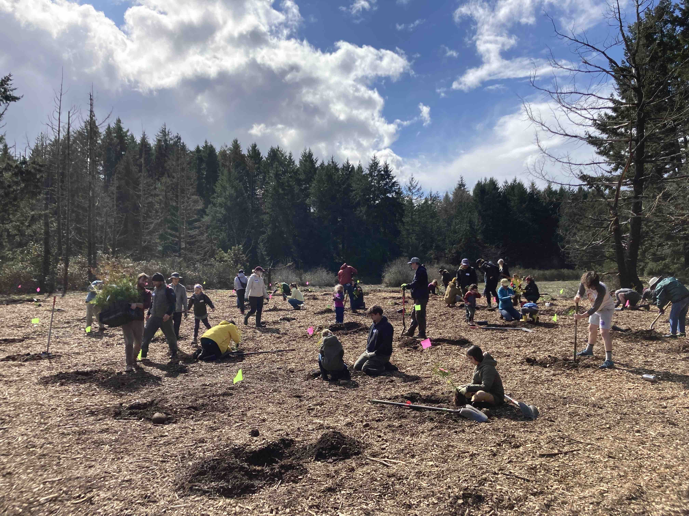
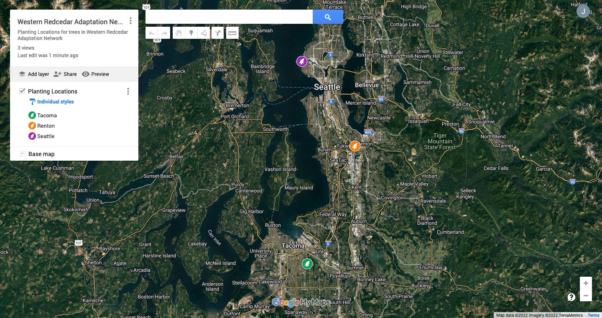
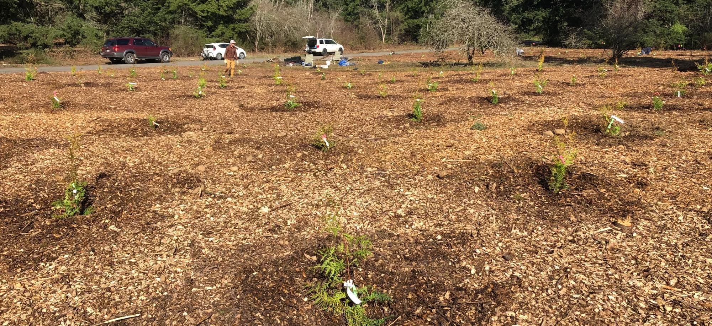

```{r setup, include=FALSE}
knitr::opts_chunk$set(echo = FALSE)
```

```{r include=FALSE}
library(tidyverse)
library(kableExtra)
library(patchwork)
library(zoo)
```

|            |            |            |            |            |
|:----------:|:----------:|:----------:|:----------:|:----------:|
|[Welcome](https://jmhulbert.github.io/adaptation)|[Data](https://jmhulbert.github.io/adaptation/data)|[Analyses](https://jmhulbert.github.io/adaptation/analyses)|
|             |           |            |            |            |



### Welcome

Welcome to the webpage for the Open Redcedar Adaptation Network! Here you will find information, resources, data, and examples of analyses for you to explore.

You are welcome to participate in a small project to explore options for conserving western redcedar. The project was designed as an open demonstration where communities can participate in the stewardship, monitoring, and comparison of redcedar trees grown from two seed sources. 

Together we can study the climate adaptation potential of this important tree species to the Pacific Northwest. 

***


### Help Shape This Project

Want to help develop or co-produce the Open Redcedar Adaptation Network? Anyone is welcome. [Connect with us](https://foresthealth.org/adaptation) and let us know you're interested.

* Current co-production partners and site stewards:
  + Lowell Wyse, [Tacoma Tree Foundation](https://www.tacomatreefoundation.org/)
  + Chloe Nelson, Metro Parks Tacoma - [ChipIn Program](https://www.metroparkstacoma.org/volunteers/chip-in/)
  + Michael Yadrick, City of Tacoma - Environmental Services
  + Eric Sterner, Seattle Parks and Recreation
  + Lindsay Malone, Green Seattle Partnership Site Steward at Discovery Park
  + Ian Gray, City of Renton - Urban Forestry
  + Ciara Fenimore and Cinnamon Bear, Manulife

### Get Involved

Want to be involved or engage your students in this project? 

Connect with us here: https://foresthealth.org/adaptation  


***


### Purpose

The purpose of this network is to provide opportunities for education about climate adaptation. Anyone is welcome to visit a planting site, measure trees to collect data, do some analyses, and share what they're learning!

||  ||  || 
|---------------------------|--|---------------------------|--|---------------------------|

### The Problem

Western redcedar is a important tree species in the Pacific Northwest, but it may need our help to stay healthy. Unfortunately, many redcedar trees have been observed dying recently and we're concerned about its survival in future climates. You can help accelerate research about the dieback by contributing to the [Western Redcedar Dieback Map](https://www.inaturalist.org/projects/western-redcedar-dieback-map) project. These observations are valuable for understanding why redcedar is unhealthy, but the next step is to explore what we can do about it.  

*What can we do to help keep this species healthy?*

### Possible Solution

Together we can explore the genetic diversity of western redcedar as a tool for keeping trees healthy in a climate adaptation study. We can investigate if trees adapted to climates in Oregon will be better suited for upcoming climates in Washington.

***

### Study Approach

We've established a network of plantings with trees grown from populations in two seed zones. Trees from each zone are planted in alternating rows at each site.

* Trees from the following seed zones are planted at all sites.
  + Willamette Valley, Oregon
  + Lewis County, Washington

> **Are trees from Oregon better adapted to future climates in Washington?** 
You can help answer this question!


#### The Network

There are three plantings of western redcedar trees at three sites in western Washington.

+ Planting Locations
    + Discovery Park, Seattle (Planted February 8, 2022)
    + Swan Creek Park, Tacoma (Planted March 19, 2022)
    + Black River Riparian Forest, Renton (Planting Date May 7th or May 14th, 2022)

Each planting location has or will have trees from both seed zones planted in rows.

|| ||
|------------------------------------|--|------------------------------------|


[](https://www.google.com/maps/d/u/1/edit?mid=1Up0ihN8qsqgXT49KyH1fZadYQfTPNbMs&usp=sharing)
Link to Google Map with planting locations


#### Openness

The data of this project are maintained openly so others can participate and learn from the study. If you collect data, please consider sharing it here so others can benefit. More instructions coming soon!


***  


### Preliminary Data {.tabset .tabset-fade}

Below you can explore some of the data available already. 

> Note the trees were not stored in a manner to compare tree heights or diameters in the first measurement. For example, before planting, we kept the trees separate to avoid accidentally mixing an Oregon tree with a Washington tree.

We plan to monitor the change in heights and diameters each year to compare between seed zones, sites, and annual climate variables. 

#### Download Data

This webpage and data are hosted in a github repository. The content on this page is compiled using R Markdown, but the data is maintained as a .csv file.

Download the data by visiting:
https://github.com/jmhulbert/adaptation

Anyone is welcome to collaborate to add or make changes to the github repository (https://github.com/jmhulbert/adaptation). 

* As a repository collaborator:
  + You are welcome to clone the repository to your system and work from the R Project file (adaptation.Rproj) in Rstudio or you can make changes to the .csv files (./data/).
  + You can also make changes directly to the .csv file through your browser.
  + Or you can make changes by downloading the .csv file, altering, committing and pushing it back to the repository.
  + You can also drop new .csv files into the ./data/ folder in the repository. 

Note that you need a github account to collaborate or make changes. Feel free to contact [JM Hulbert](https://github.com/jmhulbert) for additional details and instructions, or to request a change or addition.

**Note the Markdown (index.Rmd) file will need to be knit before the changes will be visible on this webpage.**

***



\


:::: {style="display: grid; grid-template-columns: 1fr 1fr; grid-column-gap: 10px;"}

::: {}

### Collaborators, Partners and Supporters

* The Open Redcedar Adaptation Network is powered by
  + Washington State University
  + Seattle Parks and Recreation
  + Metro Parks Tacoma
  + Tacoma Tree Foundation
  + City of Renton
  + Manulife Investment Management
  + Weyerhaeuser
  
This project is part of the [Forest Health Watch](https://foresthealth.org/) program.  
:::

::: {}
\
{width=75%}  
:::
::::


