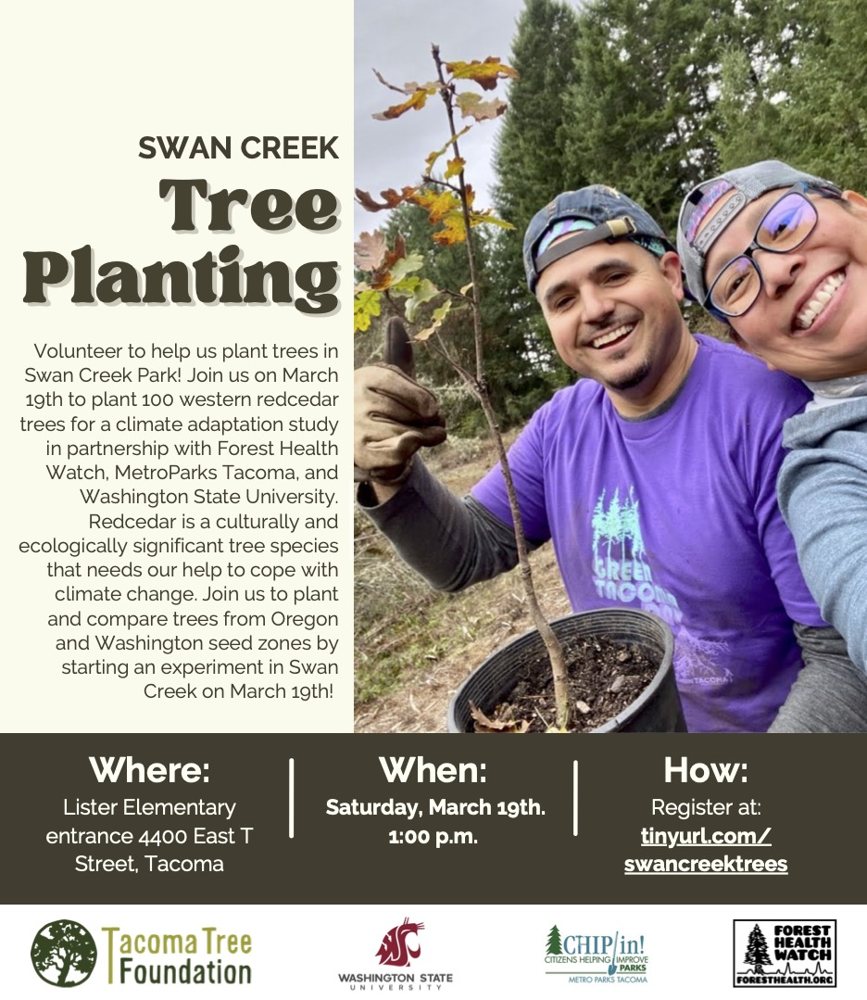

```{r setup, include=FALSE}
knitr::opts_chunk$set(echo = FALSE)
```

```{r include=FALSE}
library(tidyverse)
```


> Please note, this project, repository and webpage are still under development.

### Welcome

Welcome to the webpage for the Open Redcedar Adaptation Network! Here you will find information, resources, data, and examples of analyses for you to explore.

Together we can study the climate adaptation potential of a super important tree to the Pacific Northwest.

### Purpose

The purpose of this network is to provide opportunities for education about climate adaptation. Anyone is welcome to visit a planting site, measure trees to collect data, do some analyses, and share what they're learning!

|     |     |     |
|-----|-----|-----|

### The Problem

Western redcedar is a super important tree species in the Pacific Northwest, but it may need our help to keep stay healthy. Unfortunately, we have observed a lot of redcedar trees dying recently and we're concerned about its survival in future climates. Is there anything we can do to help keep this species healthy?

### Possible Solution

Together we can explore the genetic diversity of western redcedar as a tool for keeping trees healthy. Here we are exploring genetic diversity in a climate adaptation study. Together we can investigate if trees adapted to climates in Oregon will be better suited for upcoming climates in Washington.

### Study Approach

We've established a network of plantings with trees grown from populations in two seed zones.

#### The Network

There are four plantings of western redcedar trees throughout western Washington.

-   Planting Locations

    -   Discovery Park, Seattle (Planted February 8, 2022)
    -   Swan Creek Park, Tacoma (Planting planned on March 19, 2022)
    -   Black River Riparian Forest, Renton (Planting Date TBD)
    -   Private Forest, Enumclaw (Planting planned on March 8th, 2022)

Each planting location has or will have trees from both seed zones planted in rows.


#### Openness

The data of this project are maintained openly so others can participate and learn from the study. If you collect data, please consider sharing it here so others can benefit. More instructions coming soon!

#### Partners and Supporters

* The Open Redcedar Adaptation Network is powered by
  + Washington State University
  + Seattle Parks and Recreation
  + MetroParks Tacoma
  + City of Renton
  + Manulife Investment Management
  + Weyerhaeuser
  
  

## Data {.tabset}

### Summary
```{r}
redcedar <- read.csv("./data/WRC Tree Measurements 3.3.22.csv")
summary(redcedar)
```

### Tree Height 
```{r}
ggplot(redcedar,aes(Seed.Zone,Tree.Height..cm.)) +geom_boxplot() +theme_bw()
```

### Tree Diameter
```{r}
ggplot(redcedar,aes(Seed.Zone,Tree.Diameter..mm.)) +geom_boxplot() +theme_bw()
```
  
  