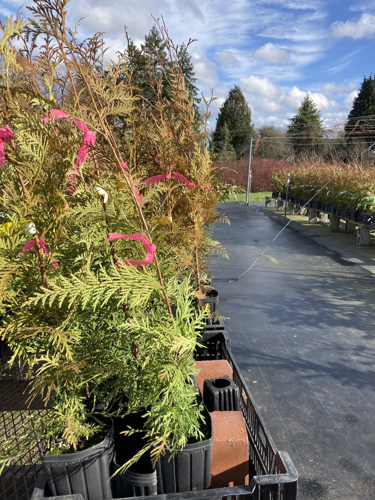
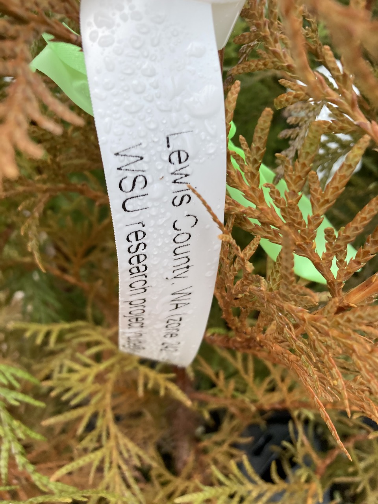
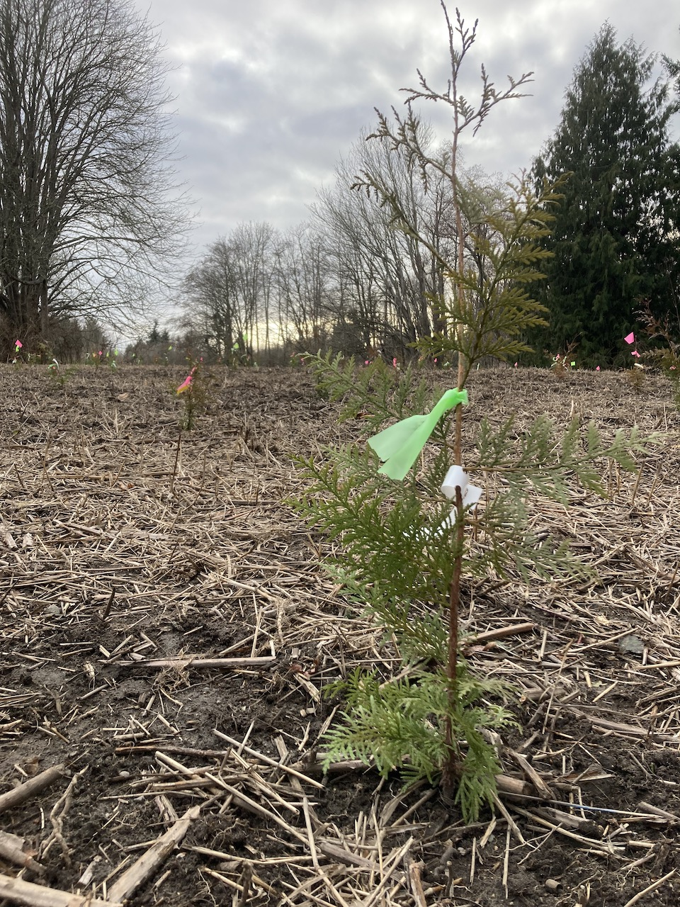
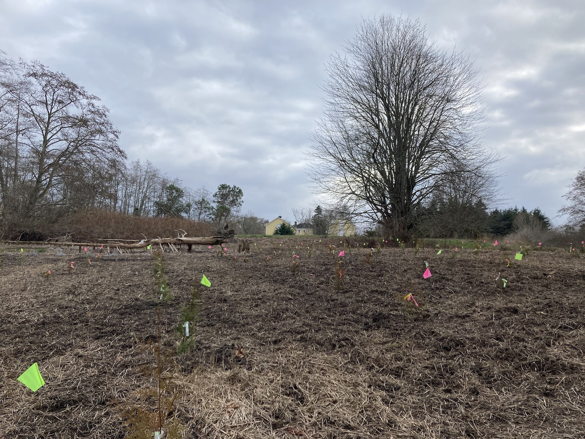
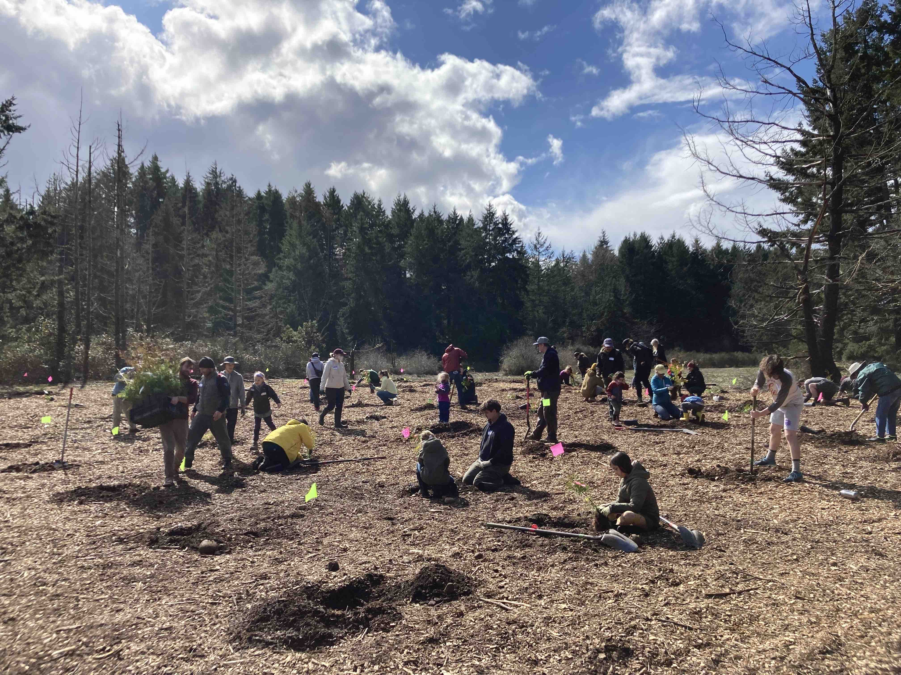
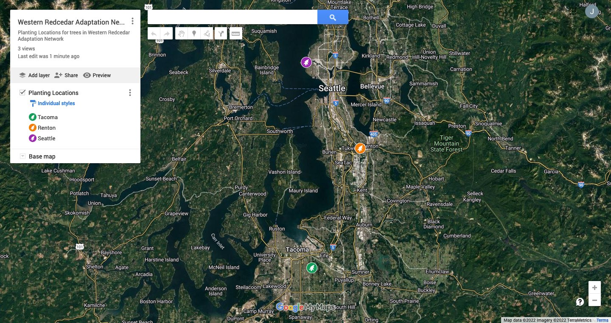
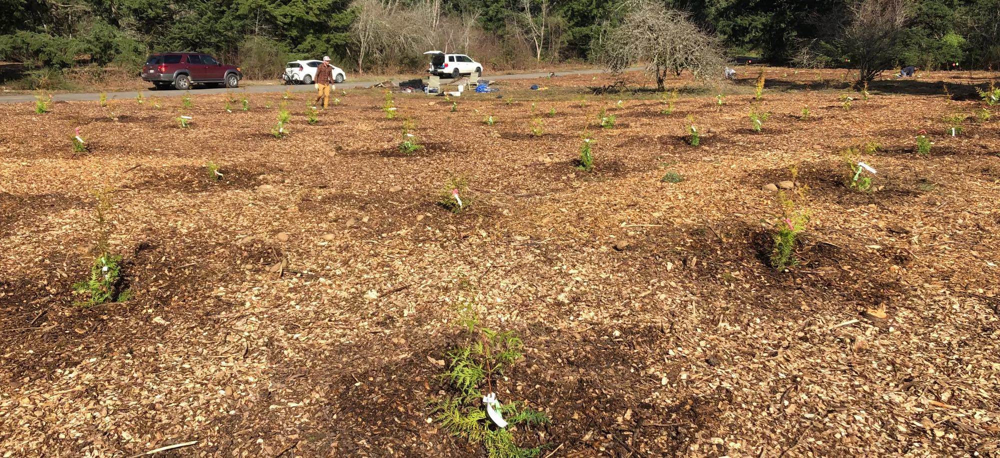

```{r setup, include=FALSE}
knitr::opts_chunk$set(echo = FALSE)
```

```{r include=FALSE}
library(tidyverse)
library(kableExtra)
library(patchwork)
```


### Welcome

Welcome to the webpage for the Open Redcedar Adaptation Network! Here you will find information, resources, data, and examples of analyses for you to explore.

You are welcome to participate in a small project to explore options for conserving western redcedar. The project was designed as an open demonstration where communities can participate in the stewardship, monitoring, and comparison of redcedar trees grown from two seed sources. 

Together we can study the climate adaptation potential of this important tree species to the Pacific Northwest. 

***


### Help Shape This Project

Want to help develop or co-produce the Open Redcedar Adaptation Network? Anyone is welcome. [Connect with us](https://foresthealth.org/adaptation) and let us know you're interested.

* Current co-production partners and site stewards:
  + Lowell Wyse, [Tacoma Tree Foundation](https://www.tacomatreefoundation.org/)
  + Chloe Nelson, Metro Parks Tacoma - [ChipIn Program](https://www.metroparkstacoma.org/volunteers/chip-in/)
  + Michael Yadrick, City of Tacoma - Environmental Services
  + Eric Sterner, Seattle Parks and Recreation
  + Lindsay Malone, Green Seattle Partnership Site Steward at Discovery Park
  + Ian Gray, City of Renton - Urban Forestry
  + Ciara Fenimore and Cinnamon Bear, Manulife

### Get Involved

Want to be involved or engage your students in this project? 

Connect with us here: https://foresthealth.org/adaptation  


***


### Purpose

The purpose of this network is to provide opportunities for education about climate adaptation. Anyone is welcome to visit a planting site, measure trees to collect data, do some analyses, and share what they're learning!

||  ||  || 
|---------------------------|--|---------------------------|--|---------------------------|

### The Problem

Western redcedar is a important tree species in the Pacific Northwest, but it may need our help to stay healthy. Unfortunately, many redcedar trees have been observed dying recently and we're concerned about its survival in future climates. You can help accelerate research about the dieback by contributing to the [Western Redcedar Dieback Map](https://www.inaturalist.org/projects/western-redcedar-dieback-map) project. These observations are valuable for understanding why redcedar is unhealthy, but the next step is to explore what we can do about it.  

*What can we do to help keep this species healthy?*

### Possible Solution

Together we can explore the genetic diversity of western redcedar as a tool for keeping trees healthy in a climate adaptation study. We can investigate if trees adapted to climates in Oregon will be better suited for upcoming climates in Washington.

***

### Study Approach

We've established a network of plantings with trees grown from populations in two seed zones. Trees from each zone are planted in alternating rows at each site.

* Trees from the following seed zones are planted at all sites.
  + Willamette Valley, Oregon
  + Lewis County, Washington

> **Are trees from Oregon better adapted to future climates in Washington?** 
You can help answer this question!


#### The Network

There are three plantings of western redcedar trees at three sites in western Washington.

+ Planting Locations
    + Discovery Park, Seattle (Planted February 8, 2022)
    + Swan Creek Park, Tacoma (Planted March 19, 2022)
    + Black River Riparian Forest, Renton (Planting Date May 7th or May 14th, 2022)

Each planting location has or will have trees from both seed zones planted in rows.

|| ||
|------------------------------------|--|------------------------------------|

\

[](https://www.google.com/maps/d/u/1/edit?mid=1Up0ihN8qsqgXT49KyH1fZadYQfTPNbMs&usp=sharing)
Link to Google Map with planting locations

\


#### Openness

The data of this project are maintained openly so others can participate and learn from the study. If you collect data, please consider sharing it here so others can benefit. More instructions coming soon!


***  


### Preliminary Data {.tabset .tabset-fade}

Below you can explore some of the data available already. 

> Note the trees were not stored in a manner to compare tree heights or diameters in the first measurement. For example, before planting, we kept the trees separate to avoid accidentally mixing an Oregon tree with a Washington tree.

We plan to monitor the change in heights and diameters each year to compare between seed zones, sites, and annual climate variables. 

#### Download Data

This webpage and data are hosted in a github repository. The content on this page is compiled using R Markdown, but the data is maintained as a .csv file.

Download the data by visiting:
https://github.com/jmhulbert/adaptation

Anyone is welcome to collaborate to add or make changes to the github repository (https://github.com/jmhulbert/adaptation). 

* As a repository collaborator:
  + You are welcome to clone the repository to your system and work from the R Project file (adaptation.Rproj) in Rstudio or you can make changes to the .csv files (./data/).
  + You can also make changes directly to the .csv file through your browser.
  + Or you can make changes by downloading the .csv file, altering, committing and pushing it back to the repository.
  + You can also drop new .csv files into the ./data/ folder in the repository. 

Note that you need a github account to collaborate or make changes. Feel free to contact [JM Hulbert](https://github.com/jmhulbert) for additional details and instructions, or to request a change or addition.

**Note the Markdown (index.Rmd) file will need to be knit before the changes will be visible on this webpage.**

#### Summary

```{r}
#2023 changes made in excel 
#y1$Seed.Zone[y1$Seed.Zone=="WA "] <- "WA"
#y1$X2022.Tree.Height..cm.[y1$X2022.Tree.Height..cm.==5408] <- 54.8
#y1$X2022.Tree.Diameter..mm.[y1$X2022.Tree.Diameter..mm.==110.0] <- 11
#y2$X2023.Tree.Diameter..mm.[y2X2022.Tree.Diameter..mm.==123] <- 12.3
#y2$X2023.Tree.Diameter..mm.[y2X2022.Tree.Diameter..mm.==135] <- 13.5

#2023 seattle OR data skipped tree number 14, moved 15, 16, 17 measurements up. 8 was missing
#2023 seattle OR site was missing trees 42 and 43, but recorded trees 39-41 in 2023 were better fit for previous 2022 measurements for 41-43. However, trees were in different row. very confused. Wondering if trees OR42 and OR43 actually got moved to end of OR31 row somehow after site was mapped? 
#2023 seattle OR last row trees 42,43, 46 and 50 were missing. However, tree number 45 fit better with tree 46, feeling confident tree recorded as 45 was actually 46, and 47 was actually missing because trees 47-49 were actually trees 48-50, adjusted
#2023 Swan Creek WA #141 included a 40cm height increase, which must be a mistake. Recommend excluding all trees with greater than 30cm height increases from first analyses. 
#2023 Swan Creek WA #171 included a 70cm height increase, which must be a mistake. Recommend excluding all trees with greater than 30cm height increases from first analyses. 
```


```{r warning=FALSE}
y1 <- read.csv("./data/2022 Measurements.csv")
y2 <- read.csv("./data/2023 MeasurementsCorrected.csv")
y3 <- read.csv("./data/2024 Measurementsv3.csv")

y1$Measurement.Year <- 2022
y2$Measurement.Year <- 2023
y3$Measurement.Year <- 2024

y1 <- y1 %>% mutate(Temp.Tree.Number = row_number())

y1 <- y1 %>% select(-c("Year.Measured","Color"))
y2 <- y2 %>% select(-c("Year.Measured","Color"))
y3 <- y3 %>% select(-c("Year.Measured"))
```

```{r}
trees.bind <- bind_rows(y1,y2) %>% bind_rows(.,y3) %>% filter(Site!="Tomanamus" & Site!="" & Site!="Puyallup") %>% droplevels()
```

```{r}
trees.bind$Health[trees.bind$Health==""] <- "Missing"
trees.bind$Health[trees.bind$Health=="missing"] <- "Missing"
trees.bind$Seed.Zone[trees.bind$Seed.Zone=="Wa"] <- "WA"
trees.bind <- trees.bind %>% droplevels()
```

```{r}
trees.bind <- trees.bind %>% group_by(Tree.Number, Site, Seed.Zone) %>% mutate(New.Tree.Number = if_else(is.na(New.Tree.Number),first(na.omit(New.Tree.Number)),New.Tree.Number)) %>%ungroup()

trees.bind <- trees.bind %>% group_by(Tree.Number, Site, Seed.Zone) %>% mutate(Temp.Tree.Number = if_else(is.na(Temp.Tree.Number),first(na.omit(Temp.Tree.Number)),Temp.Tree.Number)) %>%ungroup()

trees.bind <- trees.bind %>%  group_by(Tree.Number, Site, Seed.Zone) %>% mutate(Date.Planted = if_else(is.na(Date.Planted),first(na.omit(Date.Planted)),Date.Planted)) %>%ungroup()

trees.bind <- trees.bind %>%  group_by(Tree.Number, Site, Seed.Zone) %>% mutate(Final.Health = if_else(Measurement.Year == 2024, ifelse(is.na(Health),first(na.omit(Health)),Health),first(na.omit(Health)),Health)) %>% ungroup()
```


```{r}
trees.bind$Date.Measured <- as.Date(trees.bind$Date.Measured,"%m/%d/%y")
trees.bind$Date.Planted <- as.Date(trees.bind$Date.Planted,"%m/%d/%y")

trees.bind <- trees.bind %>% mutate(Planted.Growth.Days=Date.Measured-Date.Planted)
```

```{r}
trees <- trees.bind
```

```{r}
trees$Site <- as.factor(trees$Site)
trees$Seed.Zone <-as.factor(trees$Seed.Zone)
trees$Health <- as.factor(trees$Health)
```

```{r}
# NOTE RENTON OR TREE 180 was entered twice or there is two values for it. We need to look into this further, but for now we removed it from the data.
```

```{r}
trees <- trees %>% filter(Tree.Number!=180 | Site!="Renton" | Seed.Zone!="OR")
```

```{r}
trees.wide <- trees %>% pivot_wider(
    id_cols = c(Tree.Number, Site, Seed.Zone, New.Tree.Number),
    names_from = Measurement.Year,
    values_from = c(Tree.Height..cm., Tree.Diameter..mm.),
    names_glue = "{.value}_{Measurement.Year}") 
```

```{r} 
# see if there are any duplicate trees based on number, site, seed zone and year
#{trees} |> summarize(n = n(), .by = c(Tree.Number, Site, Seed.Zone, Measurement.Year)) |> filter(n > 1L)
```

```{r}
trees.wide.growth <- trees.wide %>% mutate(y1.height.growth = Tree.Height..cm._2023-Tree.Height..cm._2022, y2.height.growth = Tree.Height..cm._2024-Tree.Height..cm._2023, y1.diameter.growth = Tree.Diameter..mm._2023-Tree.Diameter..mm._2022, y2.diameter.growth = Tree.Diameter..mm._2024-Tree.Diameter..mm._2023, total.height.growth = Tree.Height..cm._2024-Tree.Height..cm._2022, total.diameter.growth = Tree.Diameter..mm._2024-Tree.Diameter..mm._2022)
```

```{r}
#trees.partial <- trees[1,2,3,9,11,12,13]
#trees.wide.joined <- left_join(trees.wide.growth, trees.partial, by=c("Tree.Number", "Site", "Seed.Zone"))
```

```{r}
#tree.growth <- trees %>% group_by(Tree.Number, Site, Seed.Zone) %>% arrange(Measurement.Year) %>% mutate(Height.Growth = Tree.Height..cm. - lag(Tree.Height..cm.), Diameter.Growth = Tree.Diameter..mm. - lag(Tree.Diameter..mm.)) %>% ungroup()
```

```{r}
#tree.growth.year <- tree.growth %>% group_by(Tree.Number, Site, Seed.Zone, Measurement.Year) %>% reframe(Heigh.Growth=Height.Growth,Diameter.Growth=Diameter.Growth)
```

```{r}
#trees <- left_join(trees,tree.growth.year, by=c("Tree.Number", "Site", "Seed.Zone", "Measurement.Year"))
```

```{r}
# FILTERED ALL TREES with NEGATIVE height increases or NEGATIVE diameter increases
#Data cleaning
#neg.trees <- trees %>% filter(Height.Growth<0)
#neg.trees <- neg.trees[c(1,2,3,5,6,12,13,20,21)]
#pos.trees <- trees %>% filter(Height.Growth>20)
```

```{r}
#trees.pos <- tree.growth %>% filter(Height.Growth>0 & Diameter.Growth>0)  
```

```{r}
trees.wide.pos.total <- trees.wide.growth %>% filter(total.height.growth>0 & total.diameter.growth>0)
trees.wide.pos.y1 <- trees.wide.growth %>% filter(y1.height.growth>0 & y1.diameter.growth>0)
trees.wide.pos.y2 <- trees.wide.growth %>% filter(y2.height.growth>0 & y2.diameter.growth>0)
trees.wide.pos.all <- trees.wide.growth %>% filter(y1.height.growth>0 & y1.diameter.growth>0 & y2.height.growth>0 & y2.diameter.growth>0)
```

```{r}
#a few possible mistakes in measurements with trees greater than 30cm height increase. Removing trees above 24 increase also removes Seattle OR Trees 39-41 which were off in measurements, trees were possibly moved after mapping? 
```

##### Site Plantings and Measurements

Summary coming soon.

```{r}
#create table summarizing when sites were planted and remeasured.
```


> Note the initial tree measuresments were collected on different days depending on the site (depending on when they would be planted). Therefore, comparisons between sites should be taken lightly. 

For example, trees at the Seattle site were remeasured 430 days after intial measurements, where trees at the Renton site were remeasured 342 days after initial measurement. Therefore, trees at Seattle are likely not growing faster, but rather, had larger time interval between measurements. 

##### Number of Trees

The below table lists the number of trees that were remeasured in 2024 at each site, excluding outliers. 

> Note, this table only includes trees that had positive height and diameter growth. For example, some trees were heavily browsed in 2024 and therefore may be shorter than trees in 2023. 

```{r message=FALSE, warning=FALSE}
#Site.Summary <- trees.pos %>% group_by(Site,Seed.Zone,Measurement.Year) %>% summarize(n=n()) %>% left_join(.,trees.pos,by=c("Site","Seed.Zone","Measurement.Year"),multiple="first")

Site.Summary <- trees.wide.pos.all %>% group_by(Site,Seed.Zone) %>% summarize(n=n())
kable(Site.Summary[c(1,2,3)]) %>% kable_material(c("striped", "hover","condensed"))
```

---

##### Mean Height and Diameter Increase

The below table lists mean height and diameter increases between seed zones.  


```{r warning=FALSE}
trees.summary <- trees.wide.pos.all %>% group_by(Seed.Zone)  %>% summarize(
n=n(),
mean.height.2024=mean(Tree.Height..cm._2024),
mean.diameter.2024=mean(Tree.Diameter..mm._2024),
mean.y1.height.growth=mean(y1.height.growth,na.rm=TRUE),
mean.y1.diameter.growth=mean(y1.diameter.growth,na.rm=TRUE),
mean.y2.height.growth=mean(y2.height.growth,na.rm=TRUE),
mean.y2.diameter.growth=mean(y2.diameter.growth,na.rm=TRUE),
mean.total.height.growth=mean(total.height.growth,na.rm=TRUE),
mean.total.diameter.growth=mean(total.diameter.growth,na.rm=TRUE))
kable(trees.summary,digits = 2,format = "html", table.attr='class="scrollable-table"') %>% kable_material(c("striped", "hover","condensed")) %>% kable_styling(full_width = F) %>% scroll_box(height = "300px")
```

Trees from Oregon had a mean total height increase of `r round(trees.summary$mean.total.height.growth[trees.summary$Seed.Zone=="OR"],2)`cm and trees from Washington had a mean total height increase of `r round(trees.summary$mean.total.height.growth[trees.summary$Seed.Zone=="WA"],2)`cm.

---

##### Mean Increase by Site

The table below provides the same data, expect the means were calculated across seed zones and sites. 


```{r message=FALSE, warning=FALSE}
trees.summary.sites <- trees.wide.pos.all %>% group_by(Site,Seed.Zone)  %>% summarize(
n=n(),
mean.height.2024=mean(Tree.Height..cm._2024),
mean.diameter.2024=mean(Tree.Diameter..mm._2024),
mean.y1.height.growth=mean(y1.height.growth,na.rm=TRUE),
mean.y1.diameter.growth=mean(y1.diameter.growth,na.rm=TRUE),
mean.y2.height.growth=mean(y2.height.growth,na.rm=TRUE),
mean.y2.diameter.growth=mean(y2.diameter.growth,na.rm=TRUE),
mean.total.height.growth=mean(total.height.growth,na.rm=TRUE),
mean.total.diameter.growth=mean(total.diameter.growth,na.rm=TRUE))
kable(trees.summary.sites,digits = 2) %>% kable_material(c("striped", "hover","condensed")) %>% kable_styling(full_width = F) %>% scroll_box(height = "300px")
```

\

#### Tree Height Increase

The below plots show the distributions in increases in tree height for each seed zone.

```{r}

P1 <- ggplot(trees.wide.pos.all,aes(Seed.Zone,y1.height.growth,fill=Seed.Zone)) +geom_violin() +geom_boxplot() +theme_bw()+guides(fill=FALSE) +scale_fill_manual(values=c("#E69F00", "#56B4E9")) +labs(y= "Year 1 Height Growth", x= "Seed Source",title="Year 1 Growth") + theme(plot.title = element_text(hjust = 0.5))
P2 <- ggplot(trees.wide.pos.all,aes(Seed.Zone,y2.height.growth,fill=Seed.Zone)) +geom_violin() +geom_boxplot() +theme_bw()+guides(fill=FALSE) +scale_fill_manual(values=c("#E69F00", "#56B4E9")) +labs(y= "Year 2 Height Growth",x= "Seed Source",title="Year 2 Growth") + theme(plot.title = element_text(hjust = 0.5))
P3 <- ggplot(trees.wide.pos.all,aes(Seed.Zone,total.height.growth,fill=Seed.Zone)) +geom_violin() +geom_boxplot() +theme_bw()+guides(fill=FALSE) +scale_fill_manual(values=c("#E69F00", "#56B4E9")) +labs(y= "Total Height Growth",x= "Seed Source",title="Cumulative Growth") + theme(plot.title = element_text(hjust = 0.5))

P1 + P2 + P3
```


\

---

The below plots show the distributions in increases in tree height for each seed zone and site

```{r warning=FALSE}
ggplot(trees.wide.pos.all,aes(Seed.Zone,total.height.growth,fill=Site)) +geom_boxplot() +theme_bw() +scale_fill_manual(values=c("#E69F00", "#56B4E9", "#009E73"))
```

\

#### Tree Diameter Increase

The below plots show the distributions in increases in tree diameter for each seed zone

```{r warning=FALSE}
P1 <- ggplot(trees.wide.pos.all,aes(Seed.Zone,y1.diameter.growth,fill=Seed.Zone)) +geom_violin() +geom_boxplot() +theme_bw()+guides(fill=FALSE) +scale_fill_manual(values=c("#E69F00", "#56B4E9")) +labs(y= "Year 1 Diameter Growth", x= "Seed Source" ,title="Year 1 Growth") + theme(plot.title = element_text(hjust = 0.5)) 
P2 <- ggplot(trees.wide.pos.all,aes(Seed.Zone,y2.diameter.growth,fill=Seed.Zone)) +geom_violin() +geom_boxplot() +theme_bw()+guides(fill=FALSE) +scale_fill_manual(values=c("#E69F00", "#56B4E9")) +labs(y= "Year 2 Diameter Growth",x= "Seed Source",title="Year 2 Growth") + theme(plot.title = element_text(hjust = 0.5))
P3 <- ggplot(trees.wide.pos.all,aes(Seed.Zone,total.diameter.growth,fill=Seed.Zone)) +geom_violin() +geom_boxplot() +theme_bw()+guides(fill=FALSE) +scale_fill_manual(values=c("#E69F00", "#56B4E9")) +labs(y= "Total Diameter Growth",x= "Seed Source",title="Cumulative Growth") + theme(plot.title = element_text(hjust = 0.5))

P1 + P2 + P3
```

---

\

The below plots show the distributions in increases in tree diameter for each seed zone and site

```{r warning=FALSE}
ggplot(trees.wide.pos.all,aes(Seed.Zone,total.diameter.growth,fill=Site)) +geom_boxplot() +theme_bw() +scale_fill_manual(values=c("#E69F00", "#56B4E9", "#009E73"))
```

#### Mortality

```{r message=FALSE}
trees.condition.zone <- trees %>% group_by(Seed.Zone,Final.Health) %>% summarize(n=n_distinct(Temp.Tree.Number)) %>% filter(Final.Health!="NA")
#kable(trees.condition.zone) %>% kable_material(c("striped", "hover","condensed"))
```

```{r}
ggplot(trees.condition.zone,aes(x = reorder(Seed.Zone, -n),n,fill=Final.Health))+geom_col(position = position_dodge2(preserve = "single",reverse=TRUE))+theme_bw()+coord_flip()+ scale_y_continuous(breaks = c(0,25,50,75,100,125,150),expand = expansion(mult = c(0.05, 0.1))) +scale_fill_manual(values=c( "#009E73","#56B4E9","#E69F00","#CC79A7"))+labs(x="Site",y="Number of Trees",fill="Health Condition") +geom_text(aes(label=n,group=Final.Health),position = position_dodge2(width=0.9,preserve = "single",reverse=TRUE),hjust=-0.1)
```

---

\


---

```{r message=FALSE}
trees.condition <- trees %>% group_by(Site,Seed.Zone,Final.Health) %>% summarize(n=n_distinct(Temp.Tree.Number)) %>% filter(Final.Health!="NA")
#kable(trees.condition) %>% kable_material(c("striped", "hover","condensed"))
```

```{r}
trees.condition$Final.Health <- factor(trees.condition$Final.Health, levels=c('Alive','Dying','Dead','Missing'))
```

```{r}
ggplot(trees.condition,aes(x = reorder(Site, -n),n,fill=Final.Health))+facet_wrap(~Seed.Zone)+geom_col(position = position_dodge2(preserve = "single",reverse=TRUE))+theme_bw()+coord_flip() + scale_y_continuous(expand = expansion(mult = c(0.05, 0.1))) +scale_fill_manual(values=c( "#009E73","#56B4E9","#E69F00","#CC79A7"))+labs(x="Site",y="Number of Trees",fill="Health Condition") +geom_text(aes(label=n,group=Final.Health),position = position_dodge2(width=0.9,preserve = "single",reverse=TRUE),hjust=-0.1)
```


\


###

\




\


:::: {style="display: grid; grid-template-columns: 1fr 1fr; grid-column-gap: 10px;"}

::: {}

### Collaborators, Partners and Supporters

* The Open Redcedar Adaptation Network is powered by
  + Washington State University
  + Seattle Parks and Recreation
  + Metro Parks Tacoma
  + Tacoma Tree Foundation
  + City of Renton
  + Manulife Investment Management
  + Weyerhaeuser
  
This project is part of the [Forest Health Watch](https://foresthealth.org/) program.  
:::

::: {}
\
{width=75%}  
:::
::::


